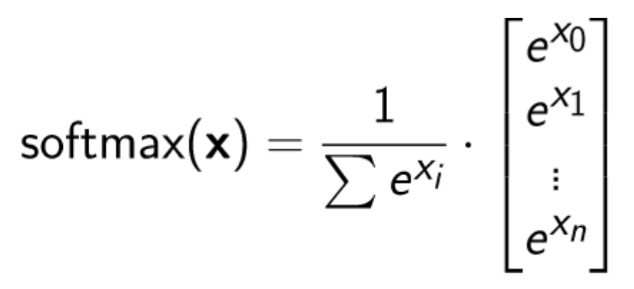
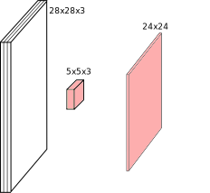
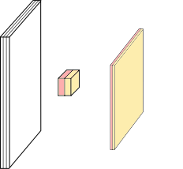
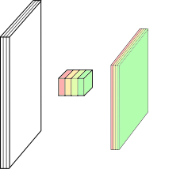
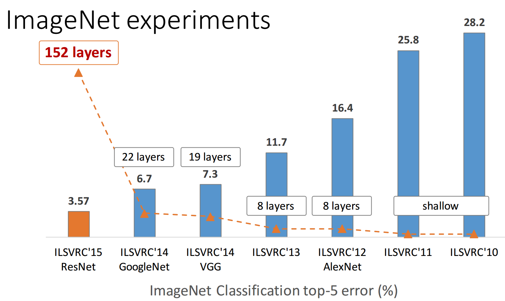
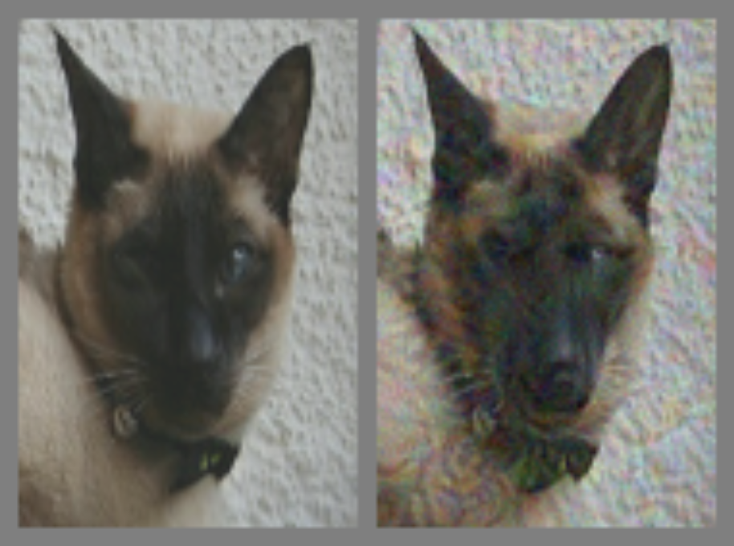
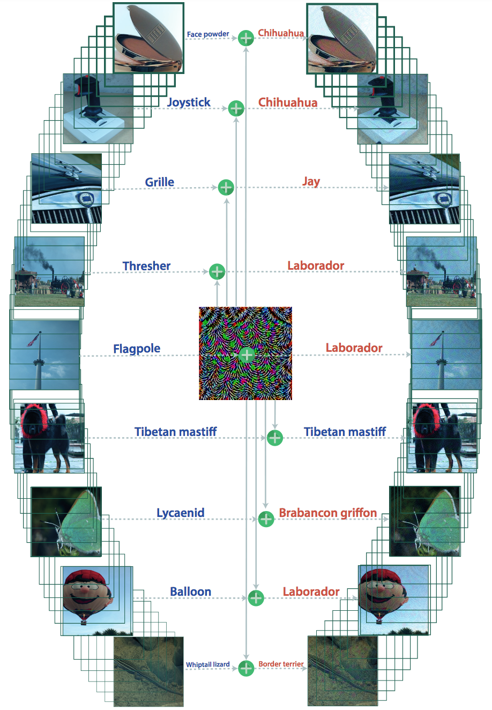

class: middle, center, title-slide

# Advanced Computing Techniques

Lecture 3: Neural Networks

---

# More Sunshine, More Hot

.width-60.center[]

Linear regression problem: $ y = Wx +b $

Use mean squared error to judge how good predictions are and adjust $W$ and $b$
to improve prediction.

---

# Is it too hot?

.width-60.center[]

Predict binary outcome (zero or one) from input variable(s).

Use a linear classifier.

---

# Is it too hot?

.width-40.center[]

$$\mathbf{y} = \mathbf{W}x + \mathbf{b}$$

$\mathbf{y}$ and $\mathbf{b}$ are now vectors, $\mathbf{W}$ is a matrix, and
$\mathbf{y}$ contains the score for each class.

What we’d really like is class probabilities.

---

# Is it too hot?

.width-40.center[]

$$\binom{y_0}{y_1} = \binom{W_0}{W_1} (x) + \binom{b_0}{b_1}$$

$\mathbf{y}$ and $\mathbf{b}$ are now vectors, $\mathbf{W}$ is a matrix, and
$\mathbf{y}$ contains the score for each class.

What we’d really like is class probabilities.

---

# The Softmax

Normalise elements of $\mathbf{x}$ so that they sum to 1. We can interpret
the new vector as a set of probabilities.

.width-40.center[]

Linear classifier (or logistic regression):
$$ \mathbf{y} = \mathsf{softmax} \( \mathbf{W} x + \mathbf{b} \) $$

$y$ now contains the normalised probabilities for each class.

---

# Logistic Regression

We have:
* function $f(x; W, b)$ that we can use to make predictions $\hat{y}$
    - $f(x; W, b) = \mathsf{softmax}(\mathbf{W} x + \mathbf{b})$
* a loss function to measure how well our model is doing $L(\hat{y}, y)$
    - log-loss or cross-entropy: $y\log p + (1-y) \log(1-p)$
* find optimal values of $\mathbf{W}$ and $\mathbf{b}$ by gradient descent
    - compute gradient of $L$ w.r.t. each parameter $\frac{dL}{dW}$ and $\frac{dL}{db}$
    - update parameters $W \leftarrow W + \alpha \frac{dL}{dW}$ and $b \leftarrow b + \alpha \frac{dL}{db}$

---

# Linear regression intermezzo

* linear-regression.ipynb
* logistic-regression.ipynb

---

# Neural networks = Magic?

.width-50.center[]

---

# Typical picture of a Neural Net

.center.width-100[]

---

# Neural networks in one slide

A (very) complicated mathematical function. That is it.

Takes in a collection of numbers (pixel intensities) and outputs numbers (class probabilities).

.larger.center[
f() $= [x_0, x_1, x_2, ..., x_7, x_8, x_9]$
]

Neural networks can have several layers.
* final layer performs logistic regression
* all previous layers transform the data from one representation to another.

---

# World's simplest Neural Network

Blackboard!

---

# Deep Neural Networks

.width-100.center[]

---

# What is Deep Learning?

.width-100.center[]

Use fixed feature extractor and tune last step using supervised learning.

---

# What is Deep Learning?

.width-100.center[]

Adjust parameters of every step using supervised learning.

---

# Why now?

Recent resurgence of neural networks thanks to deep learning.
Isn’t it all just hype?

* Often just "old algorithms".
* GPUs! Vastly more computing power available today.
* New ideas and understanding.
* More data with labels.

Key point: feed raw features to algorithm, learn everything else.

---

# Convolutional Neural Networks

.width-100.center[]

.footnote[
LeCun, Y., Bottou, L., Bengio, Y., and Haffner, P. (1998). Gradient-based learning applied to document recognition.
]

---

# Why not Fully Connected?

Standard Dense Layer for an image input:

```python
x = Input((640, 480, 3), dtype='float32')
# shape of x is: (None, 640, 480, 3)
x = Flatten()(x)
# shape of x is: (None, 640 x 480 x 3)
z = Dense(1000)(x)
```

How many parameters in the Dense layer?

--

$640 \times 480 \times 3 \times 1000 + 1000 = 922M !$

Spatial organization of the input is destroyed by `Flatten`

The solution is convolutional layers.

.footnote[From https://github.com/m2dsupsdlclass/lectures-labs]
---

# Convolution

.center[]

- slide a small ($3 \times 3$) window over the image ($5 \times 5$)
- several filters (neurons) per convolutional layer
- each output neuron is parametrised with a $3 \times 3$ weight matrix $\mathbf{w}$

.footnote[
These slides use convolution visualisations by V. Dumoulin available at https://github.com/vdumoulin/conv_arithmetic]

---

# Convolution

.center[]

The activation is obtained by sliding the $3 \times 3$ window over the image
and computing:

$$ z(x) = relu(\mathbf{w}^T x + b) $$

at each step. Where $x$ is a $3 \times 3$ chunk (dark area) of the image (blue array).

.footnote[From https://github.com/m2dsupsdlclass/lectures-labs]
---

# Advantages

Local connectivity:
- Output depends only on a few local inputs
- Translational invariance

Compared to Fully connected/Dense:
- Parameter sharing, reduced number of parameters
- Make use of spatial structure: a good assumption for vision!

.footnote[From https://github.com/m2dsupsdlclass/lectures-labs]
---

# As Code

```python
input_image = Input(shape=(28, 28, 3))
*x = Conv2D(32, 5, activation='relu')(input_image)
*x = MaxPool2D(2, strides=2)(x)
*x = Conv2D(64, 3, activation='relu')(x)
*x = MaxPool2D(2, strides=2)(x)
x = Flatten()(x)
x = Dense(256, activation='relu')(x)
x = Dense(10, activation='softmax')(x)
convnet = Model(inputs=input_image, outputs=x)
```

Two layers of convolution and pooling implemented using keras.

.footnote[From https://github.com/m2dsupsdlclass/lectures-labs]
---

# Colour channels

Coloured image = tensor of shape `(height, width, channels)`

Convolutions are usually computed for each channel and summed:

.center.width-50[]
.footnote[From https://github.com/m2dsupsdlclass/lectures-labs]
---

# Multiple convolutions (or filters)

.center.width-50[]
.footnote[From https://github.com/m2dsupsdlclass/lectures-labs]
---

# Multiple convolutions (or filters)

.center.width-50[]
.footnote[From https://github.com/m2dsupsdlclass/lectures-labs]
---

# Multiple convolutions (or filters)

.center.width-50[]
.footnote[From https://github.com/m2dsupsdlclass/lectures-labs]
---

# Multiple convolutions (or filters)

.center.width-50[]
.footnote[From https://github.com/m2dsupsdlclass/lectures-labs]
---

# Multiple convolutions (or filters)

.center.width-50[]

```python
input_image = Input(shape=(28, 28, 3))
x = Conv2D(4, 5, activation='relu')(input_image)
```
.footnote[From https://github.com/m2dsupsdlclass/lectures-labs]
---

# Strides

- Strides: increment step size for the convolution operator
- Reduces the size of the ouput map

.center[]

.center.small[
Example with kernel size $3 \times 3$ and a stride of $2$ (image in blue)
]

.footnote[From https://github.com/m2dsupsdlclass/lectures-labs]
---

# Padding

- Padding: artifically fill borders of image
- Useful to keep spatial dimension constant across filters
- Useful with strides and large receptive fields
- Usually: fill with 0s

.center.width-40[]

.footnote[From https://github.com/m2dsupsdlclass/lectures-labs]
---

# Number of parameters

Kernel or Filter shape $(F, F, C^i, C^o)$

.left-column[
- $F \times F$ kernel size,
- $C^i$ input channels
- $C^o$ output channels
]

.right-column[
  .width-40.center[]
]

--

.reset-column[
]

Number of parameters: $(F \times F \times C^i + 1) \times C^o$

--

Activations or Feature maps shape:
- Input $(W^i, H^i, C^i)$
- Output $(W^o, H^o, C^o)$

$W^o = (W^i - F + 2P) / S + 1$


???

The **filters** hold the **trainable parameters** of the model (excluding the biases).

The **feature maps** are the outputs (or **activations**) of convolution
layers when **applied to a specific batch of images**.

---

# Pooling

- Spatial dimension reduction
- Local invariance
- No parameters: typically maximum or average of 2x2 units

.center.width-80[]

.footnote[Schematic from Stanford http://cs231n.github.io/convolutional-networks]

---

# Network architectures

.width-100.center[]

.footnote[
LeCun, Y., Bottou, L., Bengio, Y., and Haffner, P. (1998). Gradient-based learning applied to document recognition.
]

---

# Classic Convolutional Network Structure

* Input

--

* Conv blocks
    - Convolution + activation (relu)
    - Convolution + activation (relu)
    - ...
    - Maxpooling 2x2

--

* Output
    - Fully connected layers
    - Softmax

---

# Hierarchical representation

.center.width-100[]

---

# VGG-16

.center.width-100[]

.footnote[Simonyan, Karen, and Zisserman. "Very deep convolutional networks for large-scale image recognition." (2014)]

---

# VGG in Keras

.smaller[
```python
    model.add(Convolution2D(64, 3, 3, activation='relu',input_shape=(3,224,224)))
    model.add(Convolution2D(64, 3, 3, activation='relu'))
    model.add(MaxPooling2D((2,2), strides=(2,2)))

    model.add(Convolution2D(128, 3, 3, activation='relu'))
    model.add(Convolution2D(128, 3, 3, activation='relu'))
    model.add(MaxPooling2D((2,2), strides=(2,2)))

    model.add(Convolution2D(256, 3, 3, activation='relu'))
    model.add(Convolution2D(256, 3, 3, activation='relu'))
    model.add(Convolution2D(256, 3, 3, activation='relu'))
    model.add(MaxPooling2D((2,2), strides=(2,2)))

    model.add(Convolution2D(512, 3, 3, activation='relu'))
    model.add(Convolution2D(512, 3, 3, activation='relu'))
    model.add(Convolution2D(512, 3, 3, activation='relu'))
    model.add(MaxPooling2D((2,2), strides=(2,2)))

    model.add(Convolution2D(512, 3, 3, activation='relu'))
    model.add(Convolution2D(512, 3, 3, activation='relu'))
    model.add(Convolution2D(512, 3, 3, activation='relu'))
    model.add(MaxPooling2D((2,2), strides=(2,2)))

    model.add(Flatten())
    model.add(Dense(4096, activation='relu'))
    model.add(Dropout(0.5))
    model.add(Dense(4096, activation='relu'))
    model.add(Dropout(0.5))
    model.add(Dense(1000, activation='softmax'))
```
]

---

.left-column[
# ResNet
]

.footnote[
.left-column[
He, Kaiming, et al. "Deep residual learning for image recognition." CVPR. 2016.
]
]

.right-column[
<div style="margin-top: -15px">
.center.width-80[]
</div>
]

Even deeper models:

34, 50, 101, 152 layers

---

.left-column[
# ResNet
]

.footnote[
.left-column[
He, Kaiming, et al. "Deep residual learning for image recognition." CVPR. 2016.
]
]

.right-column[
<div style="margin-top: -15px">
.center.width-80[]
</div>
]

.left-column[
A block learns the residual with respect to identity:

.center.width-90[]

- Good optimization properties
]
---

# Deeper is better

.width-90[]

.footnote[
from Kaiming He slides "Deep residual learning for image recognition." ICML. 2016.
]
---

# Cat or dog?

How good are you compared to a computer at quickly identifying cats vs dogs?

--

.center.width-60[]

.footnote[Elsayed et al, https://arxiv.org/abs/1802.08195]

---

# Cat or dog?

How good are you compared to a computer at quickly identifying cats vs dogs?

What is the left picture? What is the right picture?

---

# Universal Perturbation

.center.width-50[]

.footnote[Moosavi-Dezfooli et al, https://arxiv.org/abs/1610.08401v1]

---

# Do NNs understand what they see?

.center.width-100[]

.footnotes[Deep neural networks are easily fooled: High confidence predictions for unrecognizable images, http://www.evolvingai.org/fooling]

---

# What do you see?

.center.width-100[]

---

Fin.
